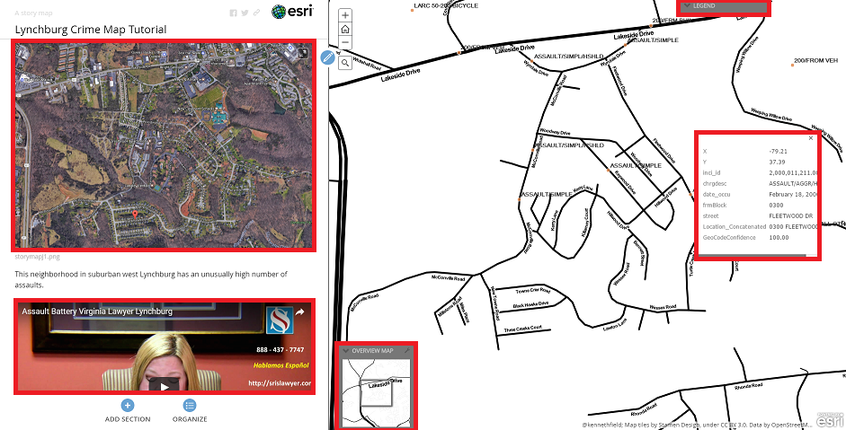

# ArcGIS Story Maps
An introductory tutorial for ArcGIS Story Maps

[ArcGIS](http://www.arcgis.com/home/index.html) is a [Geographic Information System](https://en.wikipedia.org/wiki/Geographic_information_system) platform.

It has high end professional applications and functionality, but also provides a free and public online version through which geographic data can be mapped and augmented with a variety of supplementary applications.

[Here are some examples of what you can do with ArcGIS](http://www.arcgis.com/home/gallery.html#c=esri&t=maps&o=modified)

The supplementary application we're interested in today is called [Story Maps](http://www.arcgis.com/home/gallery.html#c=esri&t=maps&o=modified&f=storymaps).

Story Maps is a powerful tool that allows you to integrate an audiovisual narrative with the relevant geographic relationships between the moments of the narrative and their spatial locations.

## Table of Contents
* [About](#about)
* [Getting Started -- Creating your Basemap](#getting-started)
* [Story Maps](#story-maps)
  * [Thrusting into Story Maps -- Sharing to Initialize an ArcGIS Application](#initializing-story-maps)
  * [Building Your Story Map Journal](#building-your-story-map-journal)
  * [Side Panel Functionality](#side-panel-functionality)
* [Supplements](#supplements)

## About
Last Updated May 2017  
Created by [Paul Vieth](http://paulkelleyvieth.org/)  
University of Oklahoma Libraries

## Getting Started

ArcGIS uses the "freemium" model, so though they provide various professional versions of their platform with high functionality for a cost, they also provide free public accounts. Before we get started, go to the [ArcGIS Online](https://www.arcgis.com/features/index.html) portal and create a free public account.

When you've done that, click on the "Map" tab of the main menu. From the Arc GIS Online frontpage, you can also access a Gallery to see the potential of ArcGIS Online, or access the maps you've made under "My Content", once you've created some.

In the "Map" section, you should be taken to this screen:

There are three things you can do from this screen:
* adjust the zoom level and the framing of the map
* choose a basemap
* add layers

### Basemap and Zoom
ArcGIS Online only allows preset quantum zooming, so you must use the "+/-" zoom buttons and operate within the coarse adjustments they permit.

ArcGIS Online provides 12 basemap options. The default is called "Topographic", but there are options for satellite imagery, monochromatic maps, streetmaps from [OpenStreetMap](https://www.openstreetmap.org/#map=5/51.500/-0.100), and others. Think tactically and tactfully about what you need to map to represent (and what you don't) in light of your project goals and aesthetic grammar.

### Layers
The layers are the most important component of this preparatory process. "Layers" in ArcGIS can either mean map tile sets, or smatterings of geographic data (what ArcGIS calls "features): both the quantitative data of latitudes and longitudes and the qualitative descriptions of what those points represent.

(Refer to the [supplements](#Supplements) section to learn how to add new tile layers (in the form of a beautiful watercolor map))

There are several ways to "lay" geographic data onto the map you've set up: click the "Add" tab from the top toolbar.

You can import layers from the web, search for publicly accessible layers on the ArcGIS Online server, or upload a file.

ArcGIS Online can work with [KML](https://developers.google.com/kml/documentation/), [GeoRSS](http://www.georss.org/), or [CSV](https://en.wikipedia.org/wiki/Comma-separated_values) files.

For this tutorial we're going to upload be using a crime incident dataset provided by the City of Lynchburg, Virginia. The City of Lynchburg maintains an open data portal in the spirit of administrative transparency. From the [Crime Incident page of the Open Data Portal](http://data-cityoflynchburg.opendata.arcgis.com/datasets/3c7b25e759a643cb9ef7d8caf6f5db21_0?mapSize=map-maximize&geometry=-79.841%2C37.193%2C-78.535%2C37.648), download the CSV file ("spreadsheet") of the dataset.

Return to the ArcGIS Online Map Viewer. Click the "Add" dropdown menu and select "add layer from file." Browse for the Lynchburg, VA crime incidents dataset you just downloaded.

Don't worry about the "Warning" window that just popped up. It's telling you the dataset has more than 1000 features, for the sake of ease and speed, dismiss this dialog box by clicking "No, Stop Adding Features".

[Another note about this dataset: It comes with unique geographic identifiers for each crime incident. If you upload your own data, ArcGIS online will ask you to connect either latitude and logitude, or a set of postal address identifiers to the column headings in your data.]

The basemap you created will automatically populate with datapoints from the "inci_id" column of the Lynchburg crime data (this is what we want, these points represent unique instances of a committed crime). 

From here you can adjust the style of the layer under "select a drawing style" (I recommend "Counts and Amounts (Size)). After you select the style, you can change the style properties by clicking "options".

This is the process for making any map in ArcGIS online. From here we will go on to create a Story Map using the map you've just created.

## Story Maps
### Initializing Story Maps

[Don't worry about my funky-looking map below; it's because I chose the [Stamen Toner tileset](http://www.arcgis.com/home/item.html?id=48bb8cc0ddef4638b12ff5c1251fddf7) for my basemap]

Notice the toolbar on the right at the top of the screen.

The measurement tool allows you to determine the area of any polygon (created by successively clicking where you want the vertices, not clicking and dragging and being limited to quandrangles); the length of any line segment, or series of non-linear but conjoined line segments (again by clicking in succession); or the latitude and longitude of a point.

You can also save you map from this toolbar. Make sure you do this now before we proceed!

Initializing your map in an ArcGIS web application is unintuitive from this view.
* Click "Share" in this top-right toolbar
* Check the box to share with "Everyone (public)"
* Click the bottom-right button "Create a web app", despite the fact that it appears inactive in grey.

This will open a dialog box with access to the full suite of ArcGIS web applications, this isn't the forum to discuss all of them, especially given their specialized functionalities, but we will explore the Story Map applications.
* Click the "Build a Story Map" tab.
 * Basic
 * Cascade
 * Crowdsource (beta)
 * Journal
 * Series
 * Shortlist (beta)
 * Swipe and Spyglass
 * Tour

We're going to be working Story Map Journal during this tutorial, but I really encourage you to play around with all 8 versions.

They represent different graphical/stylistic variations on the same concept: a map (one that you've designed in the map builder as above) accompanied by multimodal content presented with a set of geographic relationships to the map you provide. For "Story Map Basic", that content consists merely of a clean presentation window with a brief description of the map. Also, the "Story Map Crowdsource (beta)" requires an ArcGIS subscription, but the National Parks Service has created [a great example](https://storymaps.esri.com/stories/2016/national-park-memories/index.html) of the power and poignancy of this application.

* In the "Build a Story Map" tab
* Click "Story Map Journal"
* Click "Create Web App" (blue button)
* Name your Story Map and tag it with identifiable keywords (these can simply be the name and tags of the map you created above)
* and ... Click "Done"

This will take you to an option between a floating panel and a side panel. You can see live examples for both of these through this dialog box, for simplicity, just select "Side Panel" and Click "Start"

From here you can take a tour of the Story Map Journal web application, this will briefly detail the functionality of the Journal.

Now we're ready to turn our map into a story.

### Building Your Story Map Journal

The Story Map Journal interface is divided into a "Main Stage" and a "Side Panel". First select what you want your audience to see on the Main Stage. This is most often (and probably the intention of ArcGIS) a map, but you are allow to make it an image, video, or web page as well.

* In the "Select or create a map" dropdown menu, select the map of Lynchburg, VA crime incidents we created earlier, by the name you assigned your map.

* Keep all of the default options and click "Next"
* You'll then be asked to populate your Side Panel (this is where the text and media of your narrative go) ArcGIS wants you to create a home section, with a project subtitle (the title you gave earlier will display automatically), and maybe an introductory image first.

[If you want to get creative and personalize your Side Panel content with precision, you can open the code editor (tool button second-from-the-right) and input html and inline css]

Now that we've placed the Main Stage content map and the Side Panel introduction, we've established the process we can repeat to create our entire journal. All that's left is to go through the various functions of the side panel.

### Side Panel Functionality

After you've created your starting view for your Main Stage (map) and your Side Panel introduction, there are only two actions you need to perform to enlarge and enhance your story.
* "Add Section"
* "Organize"

* Click "Add Section"

Each new section involves not just creating Side Panel content for that section, but changing the display properties of the Main Stage. So when you add a section, you'll see this dialog box:

For each section you can set the content of the Main Stage to a map, image, video, or webpage.

If you keep the Main Stage content as a map, you can:
* Change the location and zoom level of the map - (Click "Custom configuration" in "Location" section)
* Choose which layers you want displayed on the map. Our map only has two layers, a basemap and a layer of crime incident datapoints. Some maps have dozens of layers of information, and discarding irrelavant layers can help clarify the point you're trying to make in a particular section - (Click "Custom configuration" in "Content" section)
* Display a pop-up containing supplementary information about a particular datapoint (feature) - (Click "Custom configuration" in "Pop-up" section)
* Since you might display only a particular detail of the map for a section, you can keep the larger map displayed - ("Overview Map" in "Extras" section)
* You can also allow your audience to see the map legend or search for addresses, places, or features (data points) on your map - ("Extras" section)

The Side Panel can present images, video, text description, links, block quotes, or bulleted and numbered lists.

Here's an example of the combined functionality of each section (highlighted in red). I recentered and zoomed the map (to a particular neighborhood); I had the map display a detail pop-up of a particular datapoint; I have the overview map displayed in the corner; the legend can drop-down from the top; I have contextualizing imagery, video, and description in the Side Panel.

I have posted the example used for this tutorial [here](http://arcg.is/2qoDTVl). Notice the effects when you scroll between sections. 

** *Now all you have to do is string sections together to create a larger multimodal narrative -- all rooted in the geographic relationships of the spatial data and the multimedia qualitative anecdotes that make that data meaningful...* **

When you're all done, you can share a link to your story map or embed it into a website. **Have fun!**

[the story map created for this tutorial is completely fabricated and unrelated to any legitimate scholarly research project (thank goodness)]

## Supplements

### Adding a New Tile Set

You can refer to [this ESRI blog post](https://blogs.esri.com/esri/arcgis/2013/04/01/using-stamen-and-mapbox-tilesets-as-basemaps-in-arcgis-com/) for adding new tile set layers to a basemap.

Maps in online mapping platforms, such as Google Maps, OpenStreetMap, ArcGIS Online, etc., display as successions of image tiles. Each map view is a matrix of tiles and as you zoom in on the map, the tiles are replaced with new tiles with more detail, thus maintaining the map's resolution.

There are a few ways to get a basemap tile set that isn't included as one of the default 12 maps in ArcGIS online.
* To manually add a tile layer from the web, refer to the above blogpost
* The easiest is just to locate a basemap layer on the ArcGIS public server and, while logged into your ArcGIS Online account, have that basemap "Open in Map Viewer".

